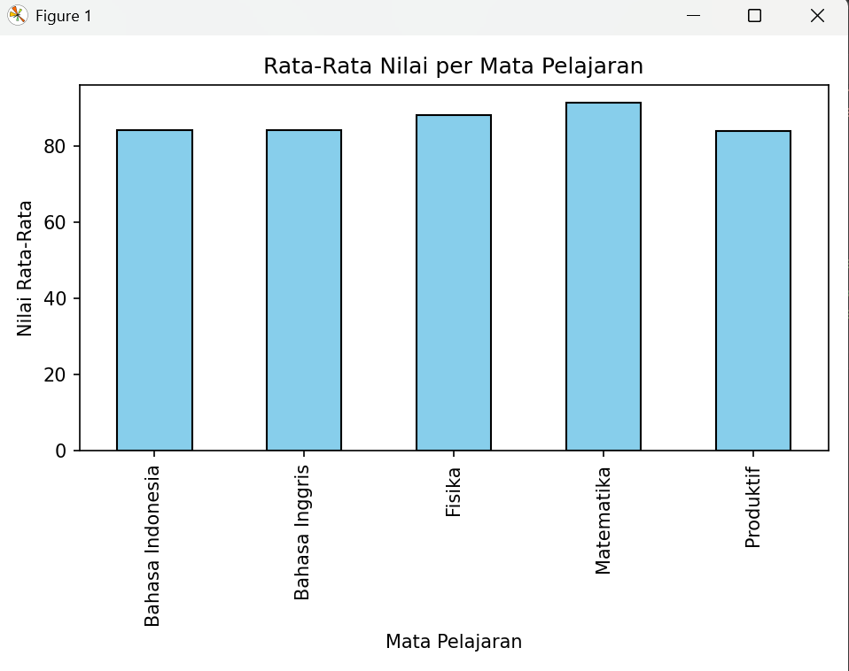

Analisis Nilai Siswa

Program ini digunakan untuk menganalisis data nilai siswa berdasarkan mata pelajaran menggunakan Python.
Program membaca data dari file CSV, menampilkan ringkasan data, dan membuat grafik batang untuk melihat rata-rata nilai per mata pelajaran.

Teknologi yang Digunakan:

Python 3

pandas (untuk membaca dan mengolah data)

matplotlib (untuk membuat grafik)

seaborn (opsional, untuk visualisasi tambahan)

Struktur File:

nilai_siswa.csv → data nilai siswa

analisis_nilai.py → kode utama program

README.txt → dokumentasi proyek

Format Data (CSV):
File nilai_siswa.csv menggunakan pemisah titik koma ( ; ) dan berisi kolom:
Nama ; Matpel ; Nilai

Contoh:
Andi ; Matematika ; 80
Budi ; Bahasa Indonesia ; 90
Citra ; Bahasa Inggris ; 75

Cara Menjalankan Program:

Pastikan Python dan pustaka berikut sudah terpasang:
pip install pandas matplotlib seaborn

Jalankan program:
python analisis_nilai.py

Program akan menampilkan:

Info dasar tentang data

5 baris pertama dataset

Statistik deskriptif

Nilai maksimum dan minimum per mata pelajaran

Rata-rata nilai per mata pelajaran

Grafik batang rata-rata nilai

Hasil Visualisasi:
Program menampilkan grafik batang yang memperlihatkan rata-rata nilai tiap mata pelajaran.
Jika ingin menampilkan boxplot (sebaran nilai), hapus tanda komentar (#) pada bagian kode seaborn.

Catatan:

Pastikan file nilai_siswa.csv berada di folder yang sama dengan file analisis_nilai.py.

Jika ada nilai kosong atau data tidak valid, program akan menampilkan peringatan di terminal.

Contoh Output Terminal:
=== INFO DATA ===
<class 'pandas.core.frame.DataFrame'>
RangeIndex: 10 entries, 0 to 9
Data columns (total 3 columns):

Column Non-Null Count Dtype

0 Nama 10 non-null object
1 Matpel 10 non-null object
2 Nilai 10 non-null int64

=== RATA-RATA per Matpel ===
Matpel
Bahasa Inggris 82.5
Bahasa Indonesia 88.0
Matematika 79.5

